# Star Tracker Report

**2026-09-05** | Total: **237 stars** | Change: **0**

> Compared to snapshot from 2026-09-03

## 📈 Star Trend

### By Repository

Individual Repository Charts

#### elboletaire/manga-downloader: 237 ★ (0)

## Repositories

| Repositories | Stars | Change | Trend |
|:-----------|------:|-------:|:-----:|
| [elboletaire/manga-downloader](https://github.com/elboletaire/manga-downloader) | 237 | 0 | ➖ |

## 🔮 Growth Forecast

**Aggregate Forecast**

| Method | Week 1 | Week 2 | Week 3 | Week 4 |
|:---|---:|---:|---:|---:|
| Linear Regression | 238 | 240 | 241 | 242 |
| Weighted Moving Average | 239 | 240 | 242 | 243 |

### By Repository

elboletaire/manga-downloader

**elboletaire/manga-downloader**

| Method | Week 1 | Week 2 | Week 3 | Week 4 |
|:---|---:|---:|---:|---:|
| Linear Regression | 238 | 240 | 241 | 242 |
| Weighted Moving Average | 239 | 240 | 242 | 243 |

---
*Generated by [GitHub Star Tracker](https://github.com/fbuireu/github-star-tracker) on 2026-09-05T08:24:34.083Z*

*Made with 🤘 by [Ferran Buireu](https://github.com/fbuireu)*

