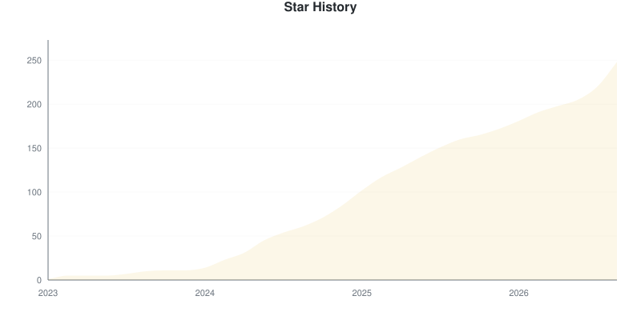
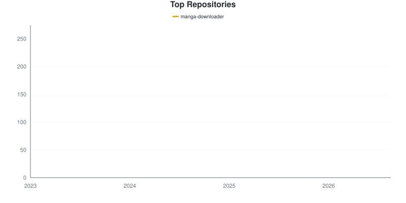
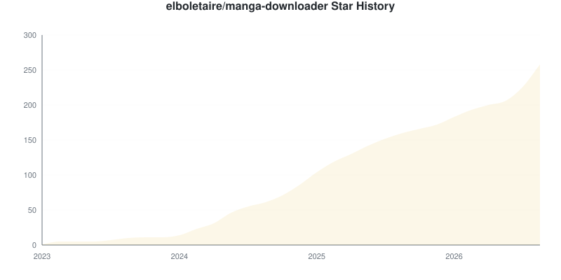
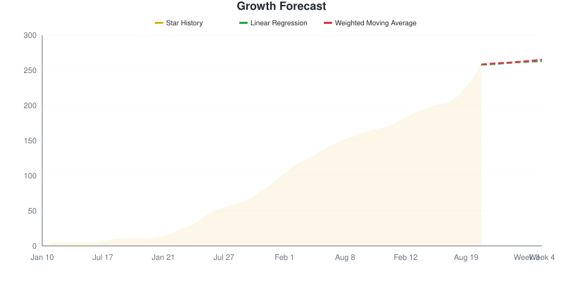
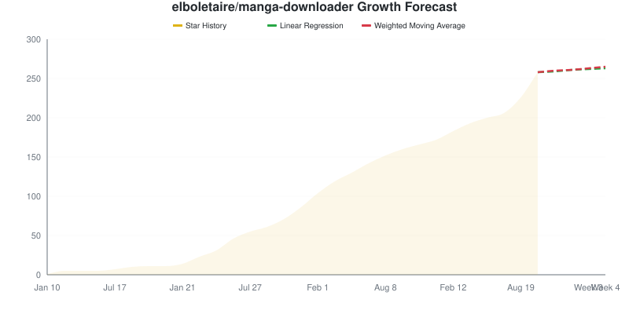

# Star Tracker Report

**2026-10-03** | Total: **255 stars** | Change: **+4**

> Compared to snapshot from 2026-10-01

## 📈 Star Trend

### By Repository

Individual Repository Charts

#### elboletaire/manga-downloader: 255 ★ (+4)

## Repositories

| Repositories | Stars | Change | Trend |
|:-----------|------:|-------:|:-----:|
| [elboletaire/manga-downloader](https://github.com/elboletaire/manga-downloader) | 255 | +4 | ⬆️ |

## Summary

- **Stars gained:** 4
- **Stars lost:** 0
- **Net change:** +4

## 🔮 Growth Forecast

**Aggregate Forecast**

| Method | Week 1 | Week 2 | Week 3 | Week 4 |
|:---|---:|---:|---:|---:|
| Linear Regression | 256 | 258 | 259 | 260 |
| Weighted Moving Average | 257 | 258 | 260 | 262 |

### By Repository

elboletaire/manga-downloader

**elboletaire/manga-downloader**

| Method | Week 1 | Week 2 | Week 3 | Week 4 |
|:---|---:|---:|---:|---:|
| Linear Regression | 256 | 258 | 259 | 260 |
| Weighted Moving Average | 257 | 258 | 260 | 262 |

---
*Generated by [GitHub Star Tracker](https://github.com/fbuireu/github-star-tracker) on 2026-10-03T09:55:27.623Z*

*Made with 🤘 by [Ferran Buireu](https://github.com/fbuireu)*

