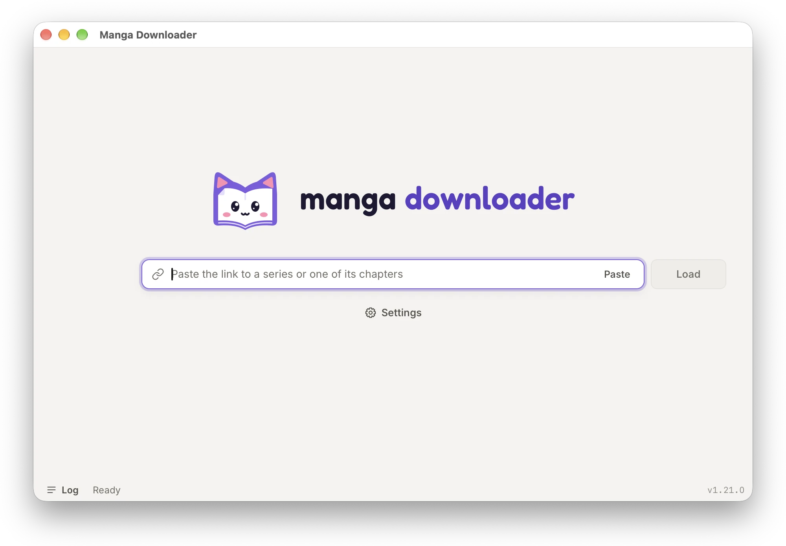

<picture>
  <source media="(prefers-color-scheme: dark)" srcset="assets/brand/readme/readme-header-dark.svg">
  
</picture>

[![Tests][tests badge]][tests]
[![GitHub release][release badge]][releases]
[![GitHub downloads][downloads badge]][releases]
[![GitHub stars][stars badge]][stargazers]
[![Docker Pulls][pulls badge]][docker hub]
[![License][license badge]][license]

⭐ If you like this project, star it on GitHub!

[Website][website] • [Features](#features) • [Installation](#installation) • [Desktop app](#using-the-desktop-app---guide) • [Command line](#using-the-command-line---guide) • [Supported sites](#supported-sites) • [Troubleshooting](#troubleshooting)

Manga Downloader downloads manga chapters from MangaDex and more than 500 other sites and
packs them into CBZ, CBR or EPUB files, ready to read on your e-reader or in
your favorite comic app. It comes as a **desktop app** for Windows, macOS and
Linux, and as a **command line tool** for scripts, servers and Docker.

<picture>
  <source media="(prefers-color-scheme: dark)" srcset="assets/screenshots/02-loaded-dark.webp">
  
</picture>

## Features

- **[553 supported sites](#supported-sites)**, from big aggregators to small
  scanlation groups.
- In the app, **paste a URL and it loads**: the series, its chapters and the
  languages and scanlation groups it offers appear on their own.
- **Pick what you need**: chapter ranges such as `1,3,5-10` (Shift+click or
  *All* in the app), and the language or scanlation group you want, on sites
  that host several versions of a chapter.
- **Keep a folder up to date**: `--skip-existing` leaves out the chapters you
  already have, so a scheduled run only fetches the new ones.
- **E-reader friendly output**: AVIF pages are converted to JPEG, so they don't
  show up blank on Kobo, KOReader or Calibre (WebP too, if you ask).
- **Flexible output**: one file per chapter, per volume or for everything, as
  CBZ, CBR, EPUB or plain image folders, named from a template.
- **Skip pages** such as credits or ads (`--skip-pages`).
- In the app, **live progress**: every chapter shows up as it's fetched and
  packed, with a summary and an *Open folder* button when it's done.
- **Sites that need a browser** (JavaScript or Cloudflare) work too: the tool
  drives a Chromium-based browser you already have and clicks the "Verify you
  are human" box for you.
- **Concurrent downloads** with retries.
- **Command line**: a single binary with no runtime, no dependencies and no
  config file, plus Docker images.
- **Desktop app**: native folder picker, and a window that follows your system's
  light or dark theme.

## Installation

### Desktop app

[![Desktop app downloads][app downloads badge]][releases]

The easiest way is the [website][website], which picks the right download for
your system. Or get it from the [releases page][releases]:

- **Windows**: `manga-downloader-gui-<tag>-windows-amd64-installer.exe`, or
  `-windows-arm64-installer.exe` for ARM devices such as Snapdragon laptops. It
  installs for your user alone (`%LOCALAPPDATA%\Programs\Manga Downloader`), or
  for everyone (`C:\Program Files\Manga Downloader`) when run as administrator,
  and adds a Start menu shortcut. For a portable copy, use the `.zip` of the
  same name instead: unzip it and run `manga-downloader-gui.exe`.
- **macOS**: `manga-downloader-gui-<tag>-darwin-universal.zip`. Unzip it and move
  `Manga Downloader.app` wherever you like. Or install it with
  [Homebrew][homebrew], which also puts `manga-downloader-gui` on your `PATH`:

  ~~~bash
  brew install --cask elboletaire/tap/manga-downloader-app
  ~~~

  If you installed the app under its old name, `manga-downloader`, run
  `brew uninstall --cask manga-downloader` first.

- **Linux**: `manga-downloader-gui-<tag>-linux-amd64.tar.gz`, or
  `-linux-arm64.tar.gz`. Extract it and run `install.sh` to add the app to
  your applications menu. It installs for your user only, into `~/.local`,
  with no root needed. Run it again to update, or with `--uninstall` to
  remove it (set the same `XDG_DATA_HOME`, if you used one):

  ~~~bash
  tar -xzf manga-downloader-gui-<tag>-linux-amd64.tar.gz
  ./manga-downloader-gui-<tag>-linux-amd64/install.sh
  ~~~

  Or just run `manga-downloader-gui` from the extracted folder. It needs
  WebKitGTK 4.1 (`libwebkit2gtk-4.1-0` on Debian and Ubuntu), which most
  desktops already have; `install.sh` tells you how to get it if it's
  missing.

> [!NOTE]
> **macOS** doesn't sign the app, so Gatekeeper blocks its first launch: allow it
> once under *System Settings → Privacy & Security* ([FAQ][faq-gatekeeper]).
>
> **Windows** may show SmartScreen's *"Windows protected your PC"* for the
> installer or the app, for the same reason: click **More info** → **Run anyway**
> ([FAQ][faq-smartscreen]). The app also needs the Microsoft Edge WebView2
> runtime, which Windows 11 and current Windows 10 already have; without it, the
> app offers to install it on first launch.

If the desktop app sits next to the command line tool or is on your `PATH` (the
Homebrew cask and the Linux `install.sh` put it there), `manga-downloader ui`
opens it. On Windows, double-clicking `manga-downloader.exe` does the same.

The app checks for a newer release when it starts and offers to update itself.
Settings (the gear icon, or Ctrl+, / ⌘,) turns that off and sets the app's
language; the [app guide](docs/app.md#settings-and-the-update-check) says what
the check sends.

### Command line

[![CLI downloads][cli downloads badge]][releases]

#### Homebrew

On macOS and Linux, install the command line tool from [Homebrew][homebrew]:

~~~bash
brew install elboletaire/tap/manga-downloader
~~~

Homebrew doesn't quarantine the command line tool, so there's no Gatekeeper
step on macOS. `brew upgrade manga-downloader` updates it. Completions for
bash, zsh and fish are installed as well.

That's the command line tool alone; the [desktop app](#desktop-app) is the
`manga-downloader-app` cask. Install both and `manga-downloader ui` opens the
app:

~~~bash
brew install elboletaire/tap/manga-downloader elboletaire/tap/manga-downloader-app
~~~

#### Prebuilt binary

Builds are published for Linux, macOS and Windows on amd64 and arm64, plus
32-bit builds for Linux and Windows (the latter named `windows-32bit-legacy`).

Download the archive for your system from the [releases page][releases], extract
it and run the binary:

~~~bash
./manga-downloader --help
~~~

To verify the download, check it against `manga-downloader-<tag>-SHA256SUMS.txt`
from the same release: `sha256sum -c --ignore-missing manga-downloader-<tag>-SHA256SUMS.txt`.

To run it from any folder, move the binary to a folder in your `PATH`, such as
`/usr/local/bin` on Linux and macOS.

`manga-downloader completion bash|zsh|fish|powershell` prints a shell
completion script. For zsh, for example:

~~~bash
manga-downloader completion zsh > "${fpath[1]}/_manga-downloader"
~~~

`manga-downloader completion --help` explains how to set up the other shells.

<b>Windows</b>: step-by-step setup

 

> [!IMPORTANT]
> This is the command line tool, so run it from a terminal as shown below:
> double-clicking `manga-downloader.exe` only shows the help ([FAQ][faq-exe]).

1. Open **PowerShell**: press the Start button, type `PowerShell` and press
   <kbd>Enter</kbd>.
2. Paste this line and press <kbd>Enter</kbd>:

   ~~~powershell
   irm https://raw.githubusercontent.com/elboletaire/manga-downloader/master/install.ps1 | iex
   ~~~

3. Close the terminal and open a new one. Then run it from any folder:

   ~~~cmd
   manga-downloader https://mangadex.org/title/a1c7c817-4e59-43b7-9365-09675a149a6f/one-piece 1-10
   ~~~

The [install script](./install.ps1) downloads the latest release to
`%LOCALAPPDATA%\Programs\manga-downloader` and adds that folder to your `PATH`.
It doesn't need administrator rights. Run the same line again to update, and
delete that folder to uninstall.

> [!TIP]
> Files are saved in the folder the terminal is in. To download straight into
> a folder, open it in File Explorer, type `cmd` in the address bar and press
> <kbd>Enter</kbd>. A terminal opens there, ready to use.

Prefer not to run a script?

 

Download the `windows-amd64` zip from the [releases page][releases] (or
`windows-arm64` if you have an ARM device, such as a Snapdragon laptop), extract
it, and copy `manga-downloader.exe` to `C:\Windows\System32`. Windows asks for
administrator permission. After that, `manga-downloader` works in any terminal.

> [!WARNING]
> It works, but `System32` is Windows' own folder: it needs administrator
> rights, and updating or uninstalling means replacing or deleting the file
> there yourself.

If SmartScreen shows *"Windows protected your PC"*, click **More info** →
**Run anyway** ([why][faq-smartscreen]).

On macOS, Gatekeeper blocks the unsigned binary the first time: allow it once under *System Settings → Privacy & Security* ([FAQ][faq-gatekeeper]).

#### Docker

[![Docker Pulls][pulls badge]][docker hub]

~~~bash
docker run --rm -it -v "$PWD:/downloads" elboletaire/manga-downloader [url] [chapters]
~~~

Files are written to the mounted `/downloads` folder, owned by user and group
`1000`; if yours differ, add `-e USER_ID=$(id -u) -e GROUP_ID=$(id -g)`.

The default image has no browser. For sites marked with `*`, use the `:browser`
image, which ships Chromium and a virtual display:

~~~bash
docker run --rm -it -v "$PWD:/downloads" elboletaire/manga-downloader:browser [url] [chapters]
~~~

`:latest` and `:browser` follow releases; `:master` and `:master-browser` are
the development version.

Showing the browser window on your own display

 

The `:browser` image passes Cloudflare challenges on its own. If a challenge
needs a real person, the browser window opens by itself, so forward your display
to see it on your Linux desktop. You may need to run `xhost +local:` first:

~~~bash
docker run --rm -it -e DISPLAY=$DISPLAY -v /tmp/.X11-unix:/tmp/.X11-unix \
    -v "$PWD:/downloads" elboletaire/manga-downloader:browser [url] [chapters]
~~~

## Using the desktop app - [guide](docs/app.md)

Not installed yet? Get it from the [website][website], or see
[Installation](#desktop-app).

<picture>
  <source media="(prefers-color-scheme: dark)" srcset="assets/screenshots/01-start-dark.webp">
  
</picture>

Paste a URL and it loads. Pick chapters with the range box, Shift+click or
*All*, choose the language and scanlation group when the site offers them, set
the folder, format and packing in *Options*, then press *Download*. The
*Activity* tab shows progress, and the summary's *Open folder* button takes you
to the files. Files go to your Downloads folder unless you choose another, and
your options are remembered for next time.

The [desktop app guide](docs/app.md) walks through every step and option, with screenshots.

## Using the command line - [guide](docs/cli.md)

Not installed yet? See [Installation](#command-line).

~~~bash
manga-downloader [flags] [url] [chapters]
~~~

- `url` is the manga's **index page**, the page that lists all its chapters.
  The URL of a single chapter works too: it resolves to the whole series.
- `chapters` is a list of numbers and ranges, such as `1,3,5-10`, or `all`.
  Leave it out and the tool asks before downloading the whole series.

Arguments aren't positional, so `manga-downloader 1-50 [url]` works too.

<picture>
  <source media="(prefers-color-scheme: dark)" srcset="assets/demos/download.gif">
  
</picture>

A few of its flags:

~~~bash
# one language, where the site lists several
manga-downloader --language es [url] 1-10
# one file per volume, as the site files them
manga-downloader --volumes auto [url] 1-20
# everything in a single file
manga-downloader --bundle [url] 1-8
# EPUB instead of CBZ
manga-downloader --format epub [url] 1-8
# only the chapters not in the folder yet, no questions asked
manga-downloader --skip-existing -o ~/Manga/Series [url] all
~~~

`manga-downloader help` lists every flag; the [command line guide](docs/cli.md)
explains them: languages and scanlation groups, bundles and volumes, image
conversion, skipping pages, skipping existing files, file name templates and
environment variables.

## Supported sites

<b>Show all 553 supported sites</b>

 

| Site | Notes | Last verified |
| --- | --- | --- |
| [02.ngomik.cc](https://02.ngomik.cc) | Indonesian | 2026-10-26 |
| [108read.com](https://www.108read.com) | Thai | 2026-10-18 |
| [1manga.co](https://1manga.co) | 1Manga, English | 2026-10-26 |
| [1punchman.com](https://1punchman.com) | English, single series | 2026-10-18 |
| [2.komikindo.shop](https://2.komikindo.shop) | Indonesian, mostly NSFW, unrelated to komikindo.ch | 2026-10-19 |
| [3asq.online](https://3asq.online) | Arabic, former 3asq.org | 2026-10-26 |
| [4porncomic.com](https://4porncomic.com) | English, mostly NSFW | 2026-10-18 |
| [adulto.seinagi.org.es](https://adulto.seinagi.org.es) | Spanish, mature | 2026-10-26 |
| [afroditscans.com](https://afroditscans.com) | Turkish | 2026-10-18 |
| [akanebanashimanga.website](https://akanebanashimanga.website) | English, single series | 2026-10-18 |
| [akazascans.org](https://akazascans.org) | English | 2026-10-18 |
| [allporncomic.io](https://allporncomic.io) | English, mostly NSFW | 2026-10-18 |
| [amangaplanet.com.tr](https://www.amangaplanet.com.tr) | Turkish | 2026-10-18 |
| [anikiga.com](https://anikiga.com) | Turkish | 2026-10-18 |
| [animeallstar1.com](https://www.animeallstar1.com) | AnimeAllStar, Spanish | 2026-10-19 |
| [animeallstar30.com](https://animeallstar30.com) | AnimeAllStar, Spanish | 2026-10-19 |
| [animeshinigami.com](https://www.animeshinigami.com) | Italian | 2026-10-26 |
| [animexnovel.com](https://www.animexnovel.com) | Portuguese, also novels | 2026-10-18 |
| [anzmanga25.com](https://www.anzmanga25.com) | AnzManga, Spanish | 2026-10-18 |
| [apcomics.org](https://apcomics.org) | English | 2026-10-22 |
| [apenasuma-fa.blogspot.com](https://apenasuma-fa.blogspot.com) | Portuguese | 2026-10-19 |
| [apollcomics.es](https://apollcomics.es) | Spanish | 2026-10-22 |
| [aquareader.org](https://aquareader.org) | English | 2026-10-26 |
| [arbxcomix.com](https://arbxcomix.com) | Arabic, mostly NSFW | 2026-10-22 |
| [archiviumbar.com](https://archiviumbar.com) | Spanish | 2026-10-22 |
| [arcurafansub.com](https://arcurafansub.com) | Turkish | 2026-10-22 |
| [arenascan.com](https://arenascan.com) |  | 2026-10-22 |
| [arhentai.net](https://arhentai.net) | Arabic, mostly NSFW | 2026-10-22 |
| [arlas.online](https://www.arlas.online) | Indonesian | 2026-10-19 |
| [arthurscan.xyz](https://arthurscan.xyz) | Portuguese | 2026-10-22 |
| [artlapsa.com](https://artlapsa.com) | English, locked chapters skipped | 2026-10-22 |
| [asacomi.jp](https://asacomi.jp) | Japanese (Comici), locked chapters skipped | ❌ failing since 2026-10-22 (checked 2026-10-22) |
| [asialotuss.com](https://asialotuss.com) | Spanish | 2026-10-19 |
| [asmotoon.com](https://asmotoon.com) \* | Asmodeus Scans | 2026-10-15 |
| [asterscans.com](https://asterscans.com) | English | 2026-10-22 |
| [asurascans.com](https://asurascans.com) | Asura Scans, former asuratoon.com | 2026-10-22 |
| [athreascans.com](https://athreascans.com) | English | 2026-10-22 |
| [atsu.moe](https://atsu.moe) | Atsumaru | 2026-10-22 |
| [auntmanhwa.com](https://auntmanhwa.com) | English, mostly NSFW | 2026-10-22 |
| [aurorascans.com](https://aurorascans.com) | redirects to qimanga.com | 2026-10-22 |
| [azorafly.com](https://azorafly.com) | Azorafly, Arabic | 2026-10-22 |
| [bacakomik.my](https://bacakomik.my) | Indonesian | 2026-10-22 |
| [bananascans.com](https://bananascans.com) | English | 2026-10-22 |
| [berserkkmanga.com](https://berserkkmanga.com) | English, single series, use a chapter URL | 2026-10-22 |
| [beyondtheataraxia.com](https://www.beyondtheataraxia.com) | Italian | 2026-10-22 |
| [bibibi-comic.com](https://bibibi-comic.com) | Japanese (Comici) | ❌ failing since 2026-10-22 (checked 2026-10-22) |
| [bigcomics.jp](https://bigcomics.jp) | Japanese, Big Comics (Comici) | 2026-10-22 |
| [bigsolo.org](https://bigsolo.org) |  | 2026-10-15 |
| [blackcloveronline.com](https://blackcloveronline.com) | Black Clover | 2026-10-22 |
| [bluesolo.org](https://bluesolo.org) | Blue Solo, French scantrad | 2026-10-26 |
| [bokunohero-academia.online](https://bokunohero-academia.online) | English, single series | 2026-10-22 |
| [boruto2bluevortex.com](https://boruto2bluevortex.com) | English, single series | 2026-10-22 |
| [bunmanga.com](https://bunmanga.com) | English | 2026-10-22 |
| [bymichiby.com](https://bymichiby.com) | Spanish | 2026-10-22 |
| [cafecomyaoi.com.br](https://cafecomyaoi.com.br) | Portuguese, mostly NSFW | 2026-10-22 |
| [cat-300.com](https://cat-300.com) | Thai | 2026-10-22 |
| [celestialmoonscan.es](https://celestialmoonscan.es) | Spanish | 2026-10-26 |
| [chainsawman-chapter.online](https://chainsawman-chapter.online) | Chainsaw Man | 2026-10-22 |
| [chainsawmannmanga.com](https://chainsawmannmanga.com) | Chainsaw Man | 2026-10-22 |
| [championcross.jp](https://championcross.jp) | Japanese, Champion Cross (Comici) | ❌ failing since 2026-10-22 (checked 2026-10-22) |
| [cocomic.co](https://cocomic.co) | English, mostly NSFW | 2026-10-22 |
| [coffeemanga.net](https://coffeemanga.net) | English | 2026-10-22 |
| [comic-action.com](https://comic-action.com) | Japanese, Web Action (GigaViewer) | 2026-10-22 |
| [comic-days.com](https://comic-days.com) | Japanese, Comic DAYS (GigaViewer) | 2026-10-22 |
| [comic-earthstar.com](https://comic-earthstar.com) | Japanese, Comic Earth Star (GigaViewer) | 2026-10-22 |
| [comic-gardo.com](https://comic-gardo.com) | Japanese, Comic Gardo (GigaViewer) | 2026-10-22 |
| [comic-growl.com](https://comic-growl.com) | Japanese, Comic Growl (Comici) | 2026-10-22 |
| [comic-ogyaaa.com](https://comic-ogyaaa.com) | Japanese, Comic Ogyaaa (GigaViewer) | 2026-10-22 |
| [comic-room-base.com](https://comic-room-base.com) | Japanese (Comici) | 2026-10-22 |
| [comic-ryu.jp](https://comic-ryu.jp) | Japanese, Comic Ryu (Comici) | ❌ failing since 2026-10-22 (checked 2026-10-22) |
| [comic-seasons.com](https://comic-seasons.com) | Japanese, Seasons (GigaViewer) | 2026-10-22 |
| [comic-trail.com](https://comic-trail.com) | Japanese, Comic Trail (GigaViewer) | 2026-10-22 |
| [comic-walker.com](https://comic-walker.com) | Japanese, KadoComi (KADOKAWA) | 2026-10-22 |
| [comic-y-ours.com](https://comic-y-ours.com) | Japanese, Comic Y-Ours (GigaViewer) | 2026-10-22 |
| [comic-zenon.com](https://comic-zenon.com) | Japanese, Comic Zenon (GigaViewer) | 2026-10-22 |
| [comic.j-nbooks.jp](https://comic.j-nbooks.jp) | Japanese (Comici) | 2026-10-19 |
| [comic.naver.com](https://comic.naver.com) | Naver Webtoon, Korean, free episodes only | 2026-10-26 |
| [comicborder.com](https://comicborder.com) | Japanese, Comic Border (GigaViewer) | 2026-10-22 |
| [comicride.jp](https://comicride.jp) | Japanese, Comic Ride (Comici) | 2026-10-22 |
| [comics.comici.jp](https://comics.comici.jp) | Japanese (Comici), portal | ❌ failing since 2026-10-22 (checked 2026-10-22) |
| [comics.manga-bang.com](https://comics.manga-bang.com) | Japanese (Comici), locked chapters skipped | 2026-10-19 |
| [comirela.com](https://comirela.com) | Japanese (Comici) | 2026-10-22 |
| [comix.to](https://comix.to) \* |  | 2026-10-15 |
| [covendasbruxonas.com](https://covendasbruxonas.com) | Coven Scan, Portuguese, mostly NSFW | 2026-10-26 |
| [csmmangafree.com](https://www.csmmangafree.com) | English, single series | 2026-10-22 |
| [cucumbermanga.com](https://cucumbermanga.com) | English | 2026-10-22 |
| [dandadanmangas.online](https://dandadanmangas.online) | English, single series | 2026-10-22 |
| [danke.moe](https://danke.moe) | Danke fürs Lesen | 2026-10-22 |
| [datgarscanlation.blogspot.com](https://datgarscanlation.blogspot.com) | Spanish | 2026-10-19 |
| [deatte5.com](https://www.deatte5.com) | English | 2026-10-26 |
| [decadencescans.com](https://reader.decadencescans.com) | Decadence Scans, slow image host | 2026-10-22 |
| [deathtollscans.net](https://reader.deathtollscans.net) |  | 2026-10-22 |
| [demonicscans.org](https://demonicscans.org) | MangaDemon / Demonic Scans | 2026-10-22 |
| [demonslayermanga.us.com](https://demonslayermanga.us.com) | English, single series, use a chapter URL | 2026-10-22 |
| [diamondfansub.com](https://diamondfansub.com) | Turkish | 2026-10-26 |
| [divascans.org](https://divascans.org) | English, locked chapters skipped | 2026-10-22 |
| [dojing.net](https://dojing.net) | Indonesian, mostly NSFW | 2026-10-22 |
| [doodmanga.com](https://www.doodmanga.com) | Thai | 2026-10-22 |
| [doujin-lc.net](https://doujin-lc.net) | Thai, mostly NSFW | 2026-10-22 |
| [doujin69.com](https://doujin69.com) | Thai, mostly NSFW | 2026-10-26 |
| [doujindistrict.com](https://doujindistrict.com) | English, mostly NSFW | 2026-10-22 |
| [doujinmoon.com](https://doujinmoon.com) | Thai, mostly NSFW | 2026-10-26 |
| [doujinx-h.com](https://doujinx-h.com) | Thai, mostly NSFW | 2026-10-22 |
| [dragonballmangaa.com](https://dragonballmangaa.com) | Dragon Ball Super | 2026-10-22 |
| [dragonballsupermanga.com](https://dragonballsupermanga.com) | English, single series, use a chapter URL | 2026-10-22 |
| [dragontea.ink](https://dragontea.ink) \* |  | 2026-10-15 |
| [dragontranslation.org](https://dragontranslation.org) | Spanish, mostly NSFW | 2026-10-22 |
| [drakecomic.net](https://drakecomic.net) | Drake Scans, former drakecomic.org | 2026-10-22 |
| [duoscanlators.blogspot.com](https://duoscanlators.blogspot.com) | Portuguese | 2026-10-19 |
| [dynasty-scans.com](https://dynasty-scans.com) | Dynasty Reader | 2026-10-22 |
| [ecchi-doujin.com](https://ecchi-doujin.com) | Thai, mostly NSFW | 2026-10-22 |
| [eldermanga.com](https://eldermanga.com) |  | 2026-10-18 |
| [elftoon.net](https://elftoon.net) | Elf Toon, former elftoon.com | 2026-10-22 |
| [en-hijala.com](https://en-hijala.com) | Hijala Translations | 2026-10-18 |
| [en-thunderscans.com](https://en-thunderscans.com) | Thunderscans | 2026-10-26 |
| [erisscans.com](https://erisscans.com) | English, locked chapters skipped | 2026-10-22 |
| [eskimangalar.com](https://eskimangalar.com) |  | 2026-10-18 |
| [euphoriascan.com](https://euphoriascan.com) | Portuguese | 2026-10-22 |
| [evascans.net](https://evascans.net) | former evascans.org | 2026-10-22 |
| [fanfox.net](https://fanfox.net) | Manga Fox | 2026-10-22 |
| [fbsquadx.com](https://fbsquadx.com) | Fleur Blanche Scan, Spanish | 2026-10-22 |
| [feelweb.jp](https://feelweb.jp) | Japanese, Feel Web (GigaViewer) | 2026-10-22 |
| [fenixproject.website](https://fenixproject.website) | Portuguese | 2026-10-26 |
| [fin-manga.com](https://www.fin-manga.com) | Thai, some adult titles | 2026-10-26 |
| [flamecomics.xyz](https://flamecomics.xyz) | Flame Comics, former Flame Scans | 2026-10-22 |
| [flash-manga.net](https://www.flash-manga.net) | Thai | 2026-10-22 |
| [fmteam.fr](https://fmteam.fr) |  | 2026-10-26 |
| [frieren.online](https://ww5.frieren.online) | English | 2026-10-26 |
| [furyosociety.com](https://furyosociety.com) |  | 2026-10-22 |
| [g-comi.jp](https://g-comi.jp) | Japanese (Comici), comic-medu.com redirects here | ❌ failing since 2026-10-22 (checked 2026-10-22) |
| [gaiatoon.com](https://gaiatoon.com) | Turkish | 2026-10-22 |
| [gakamangas.com](https://gakamangas.com) | English | 2026-10-22 |
| [galaxscanlator.blogspot.com](https://galaxscanlator.blogspot.com) | Portuguese | 2026-10-19 |
| [garciamanga.com](https://garciamanga.com) | Turkish | 2026-10-26 |
| [gdscans.com](https://gdscans.com) | GalaxyDegenScans | 2026-10-22 |
| [genztoons.org](https://genztoons.org) | Genz Toon, former genzupdates.com | 2026-10-22 |
| [ghostoon.com](https://ghostoon.com) | Turkish, mostly NSFW | 2026-10-22 |
| [globalcomix.com](https://globalcomix.com) | Western comics, free issues only | 2026-10-22 |
| [go-manga.com](https://www.go-manga.com) | Thai, some adult titles | 2026-10-26 |
| [god-doujin.com](https://god-doujin.com) | Thai, mostly NSFW | 2026-10-22 |
| [godhman.net](https://www.godhman.net) | Thai | 2026-10-22 |
| [gourmetsupremacy.com](https://gourmetsupremacy.com) | Gourmet Scans, free chapters only | 2026-10-22 |
| [grabber.zone](https://grabber.zone) | Spanish | 2026-10-22 |
| [grimscans.com](https://grimscans.com) | English, locked chapters skipped | 2026-10-22 |
| [gutsberserk.com](https://www.gutsberserk.com) | English, single series | 2026-10-22 |
| [guya.moe](https://guya.moe) | Guya, Kaguya-sama | 2026-10-22 |
| [hachirumi.com](https://hachirumi.com) | Hachirumi, Guya instance, has an NSFW section | 2026-10-22 |
| [hanamiheaven.org](https://hanamiheaven.org) | Portuguese, mostly NSFW | 2026-10-22 |
| [hanayume.com](https://hanayume.com) | Japanese (Comici), free episodes only | 2026-10-22 |
| [hanmokkuscan.blogspot.com](https://hanmokkuscan.blogspot.com) | Portuguese | 2026-10-19 |
| [harmony-scan.fr](https://harmony-scan.fr) | French | 2026-10-18 |
| [hayacomic.jp](https://hayacomic.jp) | Japanese (Comici) | 2026-10-18 |
| [heavenly-delusion.com](https://heavenly-delusion.com) | Heavenly Delusion | 2026-10-18 |
| [heavenmanga.com](https://heavenmanga.com) | Spanish | 2026-10-18 |
| [heckscans.blogspot.com](https://heckscans.blogspot.com) | Portuguese | 2026-10-19 |
| [hentai-origines.com](https://hentai-origines.com) | French, mostly NSFW | 2026-10-18 |
| [hentai-scantrad.org](https://hentai-scantrad.org) | French, mostly NSFW | 2026-10-18 |
| [hentai1.io](https://hentai1.io) | English, mostly NSFW | 2026-10-18 |
| [hentai20.io](https://hentai20.io) | English, mostly NSFW | 2026-10-18 |
| [hentai20.lol](https://hentai20.lol) | English, mostly NSFW | 2026-10-26 |
| [hentaidesi.com](https://hentaidesi.com) | English, mostly NSFW | 2026-10-18 |
| [hentaimanga.me](https://hentaimanga.me) | English, mostly NSFW | 2026-10-26 |
| [hentaiteca.online](https://hentaiteca.online) | Portuguese, mostly NSFW | 2026-10-18 |
| [hentaivn.show](https://hentaivn.show) | Vietnamese, mostly NSFW | 2026-10-18 |
| [hentaixcomic.com](https://hentaixcomic.com) | English, mostly NSFW | 2026-10-18 |
| [hentaixdickgirl.com](https://hentaixdickgirl.com) | English, mostly NSFW | 2026-10-18 |
| [hentaixyuri.com](https://hentaixyuri.com) | English, mostly NSFW | 2026-10-18 |
| [heros-web.com](https://heros-web.com) | Japanese, Hero's Web (Comici) | ❌ failing since 2026-10-22 (checked 2026-10-22) |
| [hhentai.fr](https://hhentai.fr) | French, mostly NSFW | 2026-10-18 |
| [hivetoons.org](https://hivetoons.org) | HiveToons, VoidScans | 2026-10-15 |
| [hni-scantrad.net](https://hni-scantrad.net) | HNI-scantrad, French and English | 2026-10-26 |
| [hotcabaretscan.com](https://hotcabaretscan.com) | Portuguese | 2026-10-18 |
| [houseofotakusv2.xyz](https://houseofotakusv2.xyz) | Spanish | 2026-10-18 |
| [hunlightcomics.com](https://hunlightcomics.com) | English | 2026-10-19 |
| [ichi-the-witch.com](https://ichi-the-witch.com) | English, single series | 2026-10-19 |
| [ichicomi.com](https://ichicomi.com) | Japanese, Ichi Comic (GigaViewer) | 2026-10-19 |
| [imanevilgod.com](https://imanevilgod.com) | English, single series | 2026-10-26 |
| [infrafandub.com](https://infrafandub.com) | Spanish | 2026-10-19 |
| [inkapk.net](https://inkapk.net) | Portuguese | 2026-10-19 |
| [inmanga.com](https://inmanga.com) |  | 2026-10-19 |
| [inu-manga.net](https://www.inu-manga.net) | Thai | 2026-10-19 |
| [inventariooculto.com](https://inventariooculto.com) | Spanish | 2026-10-19 |
| [izanamiscans.my.id](https://izanamiscans.my.id) | Indonesian | 2026-10-19 |
| [jellycomics.online](https://jellycomics.online) | Vietnamese, mostly NSFW, use a series URL | 2026-10-26 |
| [jestful.net](https://jestful.net) |  | 2026-10-19 |
| [jojolandsmanga.com](https://jojolandsmanga.com) | The JoJoLands | 2026-10-19 |
| [jujutsukaisenmanga.pro](https://jujutsukaisenmanga.pro) | Jujutsu Kaisen | 2026-10-19 |
| [kaijuno8chapters.com](https://kaijuno8chapters.com) | English, single series | 2026-10-19 |
| [kaijunochapter.com](https://kaijunochapter.com) | English, single series | 2026-10-19 |
| [kaliscan.org](https://kaliscan.org) | English, mostly NSFW | 2026-10-19 |
| [kansai.mag-garden.co.jp](https://kansai.mag-garden.co.jp) | Japanese, Mag Garden Kansai (Comici) | 2026-10-19 |
| [kanzenin.info](https://kanzenin.info) | Indonesian, mostly NSFW | 2026-10-19 |
| [kappabeast.com](https://kappabeast.com) \* |  | 2026-10-15 |
| [kaynscans.com](https://kaynscans.com) | Kayn Scans, former kaynscan.org | 2026-10-19 |
| [kazokuden.com](https://www.kazokuden.com) | Spanish | 2026-10-19 |
| [kencomics.com](https://kencomics.com) | Ken Scans, English, locked chapters skipped | 2026-10-26 |
| [keroscans.net](https://keroscans.net) | English, locked chapters skipped | 2026-10-26 |
| [kewnscans.org](https://kewnscans.org) | English | 2026-10-19 |
| [kimicomi.com](https://kimicomi.com) | Japanese (Comici) | 2026-10-19 |
| [kingofshojo.com](https://kingofshojo.com) |  | 2026-10-19 |
| [kitsunedawn.com](https://kitsunedawn.com) | English | 2026-10-19 |
| [klikmanga.org](https://klikmanga.org) | Indonesian | 2026-10-19 |
| [kmansin09.top](https://kmansin09.top) | Japanese, raw | 2026-10-26 |
| [kokomangas.com](https://kokomangas.com) | English | 2026-10-19 |
| [kombatch.cc](https://kombatch.cc) | Indonesian | 2026-10-19 |
| [komikdewasa.art](https://komikdewasa.art) | Indonesian, mostly NSFW | 2026-10-19 |
| [komikdewasa.mom](https://komikdewasa.mom) | Indonesian, mostly NSFW | 2026-10-26 |
| [komikindo.ch](https://komikindo.ch) |  | 2026-10-19 |
| [komikmanga.com](https://komikmanga.com) | MangaReader, English | 2026-10-19 |
| [komikmu.top](https://komikmu.top) | Indonesian | 2026-10-19 |
| [komikstation.org](https://komikstation.org) | Indonesian | 2026-10-19 |
| [komiktap.info](https://komiktap.info) | Indonesian, mostly NSFW | 2026-10-26 |
| [komiku.org](https://komiku.org) | Indonesian | 2026-10-22 |
| [ksgroupscans.com](https://ksgroupscans.com) | KSGroupScans | 2026-10-19 |
| [kumapoi.info](https://kumapoi.info) | Indonesian, mostly NSFW, doujinshi | 2026-10-19 |
| [kuragebunch.com](https://kuragebunch.com) | Japanese, Kurage Bunch (GigaViewer) | 2026-10-19 |
| [lagoonscans.com](https://lagoonscans.com) |  | 2026-10-19 |
| [lavascans.com](https://lavascans.com) | Arabic | 2026-10-26 |
| [lector-darkroomfansub.blogspot.com](https://lector-darkroomfansub.blogspot.com) | Spanish, mostly NSFW | 2026-10-19 |
| [lector.lolivault.net](https://lector.lolivault.net) | Spanish, mature | 2026-10-26 |
| [lector.pzykosis666hfansub.com](https://lector.pzykosis666hfansub.com) | Spanish, mature | 2026-10-26 |
| [lectorhades.latamtoon.com](https://lectorhades.latamtoon.com) | Spanish | 2026-10-19 |
| [lectortaurus.com](https://lectortaurus.com) | Spanish | 2026-10-19 |
| [leercapitulo.co](https://www.leercapitulo.co) |  | 2026-10-19 |
| [leermanhwas.com](https://leermanhwas.com) | Spanish, mostly NSFW | 2026-10-19 |
| [legionscans.com](https://legionscans.com) | Spanish | 2026-10-19 |
| [leitor.borutoexplorer.com.br](https://leitor.borutoexplorer.com.br) | Portuguese | 2026-10-22 |
| [leitor.kamisama.com.br](https://leitor.kamisama.com.br) | Portuguese | 2026-10-19 |
| [lelmanga.com](https://www.lelmanga.com) | French | 2026-10-19 |
| [lelscanfr.com](https://www.lelscanfr.com) | French | 2026-10-19 |
| [lelscans.net](https://lelscans.net) | French | 2026-10-19 |
| [lepoytl.my.id](https://www.lepoytl.my.id) | Indonesian | 2026-10-19 |
| [ler999.blogspot.com](https://ler999.blogspot.com) | Portuguese | 2026-10-19 |
| [lhtranslation.net](https://lhtranslation.net) | LHTranslation | 2026-10-26 |
| [lianscans.com](https://www.lianscans.com) | Indonesian, mostly NSFW | 2026-10-26 |
| [lilymanga.net](https://lilymanga.net) | yuri, some NSFW | 2026-10-15 |
| [limonmanga.com](https://limonmanga.com) |  | 2026-10-18 |
| [linkmanga.com](https://linkmanga.com) | English | 2026-10-19 |
| [loner-tl.blogspot.com](https://loner-tl.blogspot.com) | Arabic | 2026-10-19 |
| [lovesjane.site](https://lovesjane.site) | English | 2026-10-26 |
| [luacomic.org](https://luacomic.org) | LuaScans | 2026-10-15 |
| [lupiteam.net](https://lupiteam.net) | LupiTeam, Italian | 2026-10-26 |
| [m1.manhwalist.my.id](https://m1.manhwalist.my.id) | Indonesian | 2026-10-18 |
| [madaradex.org](https://madaradex.org) | some adult titles | 2026-10-19 |
| [madarascans.net](https://madarascans.net) | former madarascans.org/.com | 2026-10-19 |
| [magcomi.com](https://magcomi.com) | Japanese, Mag Garden (GigaViewer) | 2026-10-19 |
| [magustoon.org](https://magustoon.org) | English, locked chapters skipped | 2026-10-19 |
| [mahoushoujobu.com](https://mahoushoujobu.com) | English | 2026-10-19 |
| [maid.my.id](https://www.maid.my.id) |  | 2026-10-19 |
| [manga-ai-land.blogspot.com](https://manga-ai-land.blogspot.com) | Arabic | 2026-10-19 |
| [manga-corporation.com](https://manga-corporation.com) | Manga-Corporation, French | 2026-10-26 |
| [manga-lc.net](https://manga-lc.net) | Thai | 2026-10-19 |
| [manga-neko.com](https://manga-neko.com) | Thai, some adult titles | 2026-10-26 |
| [manga-zegra.com](https://manga-zegra.com) | Japanese (Comici) | 2026-10-19 |
| [manga.adonisfansub.com](https://manga.adonisfansub.com) | Adonis Fansub, Turkish | 2026-10-18 |
| [manga.smuglo.li](https://manga.smuglo.li) | Lilyreader, yuri | ❌ failing since 2026-10-26 (checked 2026-10-26) |
| [manga18.me](https://manga18.me) | English, mature | 2026-10-26 |
| [manga18free.com](https://manga18free.com) | English, mostly NSFW | 2026-10-19 |
| [manga18fx.com](https://manga18fx.com) | English, mature | 2026-10-26 |
| [mangaball.com](https://mangaball.com) | former mangaball.net | 2026-10-18 |
| [mangabats.com](https://www.mangabats.com) | former mangabat.com | 2026-10-19 |
| [mangaberri.com](https://mangaberri.com) |  | 2026-10-19 |
| [mangabu.jp](https://mangabu.jp) | Japanese (Comici) | 2026-10-19 |
| [mangacrazy.net](https://mangacrazy.net) | English, mostly NSFW | 2026-10-19 |
| [mangadass.com](https://mangadass.com) | English, mature | 2026-10-26 |
| [mangadelsiglotvmanga.com.mx](https://www.mangadelsiglotvmanga.com.mx) | Manga del Siglo TV Manga, Spanish | 2026-10-19 |
| [mangadenizi.net](https://www.mangadenizi.net) |  | 2026-10-19 |
| [mangadex.org](https://mangadex.org) | MangaDex | 2026-10-19 |
| [mangadistrict.com](https://mangadistrict.com) | English, mostly NSFW | 2026-10-19 |
| [mangadna.com](https://mangadna.com) | English, mature | 2026-10-26 |
| [mangaeclipse.com](https://mangaeclipse.com) | Manga Eclipse | 2026-10-19 |
| [mangafire.to](https://mangafire.to) \* |  | 2026-10-15 |
| [mangaforfree.com](https://mangaforfree.com) | English | 2026-10-19 |
| [mangaforfree.net](https://mangaforfree.net) | multilingual, mostly NSFW | 2026-10-19 |
| [mangafox.fun](https://mangafox.fun) | MangaFox, English | 2026-10-26 |
| [mangafree.info](https://mangafree.info) | English | 2026-10-19 |
| [mangahere.cc](https://www.mangahere.cc) | MangaHere | 2026-10-19 |
| [mangahere.onl](https://mangahere.onl) | MangaHere, English | 2026-10-26 |
| [mangahub.io](https://mangahub.io) |  | 2026-10-26 |
| [mangaisekaithai.net](https://www.mangaisekaithai.net) | Thai | 2026-10-26 |
| [mangak.io](https://mangak.io) | MangaK, former mangabuddy.com | 2026-10-19 |
| [mangakakalot.fun](https://mangakakalot.fun) | MangaKakalot, English | 2026-10-26 |
| [mangakakalot.gg](https://www.mangakakalot.gg) \* | MangaKakalot | 2026-10-15 |
| [mangakatana.com](https://mangakatana.com) |  | 2026-10-19 |
| [mangakimi.com](https://www.mangakimi.com) | Thai | 2026-10-19 |
| [mangalami.com](https://mangalami.com) | LamiManga, Thai | 2026-10-19 |
| [mangalib.me](https://mangalib.me) | MangaLib | 2026-10-15 |
| [mangalivre.to](https://mangalivre.to) | Manga Livre, former mangalivre.tv/mangalivre.net | 2026-10-19 |
| [mangalt.jp](https://mangalt.jp) | Japanese (Comici) | 2026-10-19 |
| [mangamaniacs.org](https://mangamaniacs.org) | English, mostly NSFW, yaoi | 2026-10-19 |
| [manganato.gg](https://www.manganato.gg) \* | MangaNato | 2026-10-19 |
| [manganel.me](https://manganel.me) | MangaNel, English | 2026-10-26 |
| [mangaonline.fun](https://mangaonline.fun) | MangaOnline, English | 2026-10-26 |
| [mangaowl.io](https://mangaowl.io) | English | 2026-10-19 |
| [mangapanda.onl](https://mangapanda.onl) | MangaPanda, English | 2026-10-26 |
| [mangapark.cc](https://mangapark.cc) | MangaPark | 2026-10-19 |
| [mangapark.tv](https://mangapark.tv) | English, unrelated to mangapark.cc | 2026-10-19 |
| [mangapill.com](https://mangapill.com) |  | 2026-10-19 |
| [mangaplus.shueisha.co.jp](https://mangaplus.shueisha.co.jp) | Manga Plus, Shueisha's official reader | 2026-10-15 |
| [mangaread.org](https://www.mangaread.org) |  | 2026-10-19 |
| [mangareader.site](https://mangareader.site) | MangaReader, English | 2026-10-26 |
| [mangas-origines.fr](https://mangas-origines.fr) | French | 2026-10-18 |
| [mangaspa.nikkan-spa.jp](https://mangaspa.nikkan-spa.jp) | Japanese (Comici), mostly NSFW | ❌ failing since 2026-10-26 (checked 2026-10-26) |
| [mangastep.com](https://mangastep.com) | Thai | 2026-10-19 |
| [mangasushi.org](https://mangasushi.org) |  | 2026-10-19 |
| [mangasusuku.com](https://mangasusuku.com) | Indonesian, mostly NSFW | 2026-10-19 |
| [mangataro.org](https://mangataro.org) |  | 2026-10-19 |
| [mangatime-square.com](https://mangatime-square.com) | Japanese, Mangatime Square (GigaViewer) | 2026-10-19 |
| [mangatoday.fun](https://mangatoday.fun) | MangaToday, English | 2026-10-26 |
| [mangatop.org](https://mangatop.org) | English | 2026-10-26 |
| [mangatown.com](https://www.mangatown.com) |  | 2026-10-19 |
| [mangatrend.org](https://mangatrend.org) | English | 2026-10-19 |
| [mangavault.lat](https://mangavault.lat) | MangaVault | 2026-10-19 |
| [mangaworld.mx](https://www.mangaworld.mx) | MangaWorld, Italian | 2026-10-19 |
| [mangawow.org](https://mangawow.org) | MangaWOW, Turkish | 2026-10-19 |
| [mangaxhentai.com](https://mangaxhentai.com) | Arabic, mostly NSFW | 2026-10-19 |
| [mangazin.org](https://mangazin.org) | MANGA ZIN | 2026-10-19 |
| [mangtto.com](https://mangtto.com) | Mangitto | 2026-10-15 |
| [manhuabug.com](https://www.manhuabug.com) | Thai | 2026-10-19 |
| [manhuahot.com](https://manhuahot.com) | English | 2026-10-19 |
| [manhuanext.com](https://manhuanext.com) | English | 2026-10-19 |
| [manhuaplus.com](https://manhuaplus.com) |  | 2026-10-19 |
| [manhuathai.com](https://www.manhuathai.com) | Thai | 2026-10-19 |
| [manhuatop.org](https://manhuatop.org) \* |  | 2026-10-15 |
| [manhuaus.com](https://manhuaus.com) \* |  | 2026-10-15 |
| [manhwa-online.com](https://manhwa-online.com) | Spanish | 2026-10-18 |
| [manhwa18.cc](https://manhwa18.cc) | English, mature | 2026-10-26 |
| [manhwa18tx.com](https://manhwa18tx.com) | English, mature | 2026-10-26 |
| [manhwa68.com](https://manhwa68.com) | English, mostly NSFW | 2026-10-26 |
| [manhwabreakup.com](https://www.manhwabreakup.com) | Thai | 2026-10-19 |
| [manhwabuddy.com](https://manhwabuddy.com) | English, raws | 2026-10-18 |
| [manhwaclub.net](https://manhwaclub.net) | multilingual | 2026-10-18 |
| [manhwaddict.com](https://manhwaddict.com) | English, mature | 2026-10-26 |
| [manhwaden.com](https://www.manhwaden.com) | English | 2026-10-26 |
| [manhwadesu.wiki](https://manhwadesu.wiki) | Indonesian, mostly NSFW | 2026-10-18 |
| [manhwagalaxy.com](https://manhwagalaxy.com) | English, mature | 2026-10-26 |
| [manhwahub.to](https://manhwahub.to) | English, mostly NSFW | 2026-10-18 |
| [manhwanex.com](https://manhwanex.com) | English | 2026-10-18 |
| [manhwaonline.org](https://manhwaonline.org) |  | 2026-10-18 |
| [manhwareads.com](https://manhwareads.com) | English | 2026-10-18 |
| [manhwatop.com](https://manhwatop.com) | MANHWATOP | 2026-10-18 |
| [marmota.me](https://marmota.me) | Spanish | 2026-10-18 |
| [mehentai.live](https://mehentai.live) | Vietnamese, mostly NSFW | 2026-10-26 |
| [mgeko.cc](https://www.mgeko.cc) |  | 2026-10-18 |
| [mhscans.com](https://mhscans.com) | Spanish | 2026-10-18 |
| [mihentai.net](https://mihentai.net) | Indonesian, mostly NSFW | 2026-10-18 |
| [mikrokosmosfb.blogspot.com](https://mikrokosmosfb.blogspot.com) | Turkish, mostly NSFW | 2026-10-19 |
| [mindafansub.dev](https://mindafansub.dev) | Turkish, mostly NSFW | 2026-10-18 |
| [mistscans.com](https://mistscans.com) |  | 2026-10-18 |
| [mkissa.to](https://mkissa.to) \* |  | 2026-10-15 |
| [monopolymanhua.com](https://monopolymanhua.com) | Spanish | 2026-10-18 |
| [montetaiscanlator.xyz](https://montetaiscanlator.xyz) | Portuguese | 2026-10-26 |
| [mrtenzus.com](https://mrtenzus.com) | Portuguese | 2026-10-26 |
| [mundomanhwa.com](https://mundomanhwa.com) | Spanish | 2026-10-26 |
| [myreadingcomic.com](https://myreadingcomic.com) | English, mostly NSFW | 2026-10-26 |
| [nabicix.com](https://www.nabicix.com) | Turkish, former nabimanga.com | ❌ failing since 2026-10-26 (checked 2026-10-26) |
| [namicomic.jp](https://namicomic.jp) | Japanese (Comici) | ❌ failing since 2026-10-26 (checked 2026-10-26) |
| [narasininja.net](https://narasininja.net) | Indonesian | ❌ failing since 2026-10-26 (checked 2026-10-26) |
| [natomanga.com](https://www.natomanga.com) \* | MangaNato, former manganato.com/manganelo.com | 2026-10-15 |
| [natsu.one](https://natsu.one) | NatsuID, Indonesian, some adult titles, former natsu.id | 2026-10-26 |
| [nebulosascan.com](https://nebulosascan.com) | Portuguese | 2026-10-26 |
| [nekoproject.org](https://nekoproject.org) | Spanish | 2026-10-26 |
| [ngamenkomik05.blogspot.com](https://ngamenkomik05.blogspot.com) | Indonesian | 2026-10-19 |
| [nhaduong.com](https://nhaduong.com) | Vietnamese | 2026-10-26 |
| [niji-translations.com](https://niji-translations.com) | Niji, Arabic, yuri | 2026-10-26 |
| [ninjacomics.xyz](https://ninjacomics.xyz) | Portuguese | ❌ failing since 2026-10-26 (checked 2026-10-26) |
| [nirvanamanga.com](https://nirvanamanga.com) | Turkish | 2026-10-26 |
| [nocfsb.com](https://nocfsb.com) | Portuguese, mostly NSFW | 2026-10-26 |
| [noranofansub.com](https://www.noranofansub.com) | NoraNoFansub, Spanish | 2026-10-26 |
| [noromax02.my.id](https://noromax02.my.id) | Indonesian | 2026-10-26 |
| [novelcrow.com](https://novelcrow.com) | English, mostly NSFW, Western comics | ❌ failing since 2026-10-26 (checked 2026-10-26) |
| [noxsubs.net](https://noxsubs.net) | Turkish | 2026-10-26 |
| [ntr-manga.net](https://www.ntr-manga.net) | Thai, mostly NSFW | 2026-10-26 |
| [nyanukafe.com](https://nyanukafe.com) | English | 2026-10-26 |
| [nyraxmanga.com](https://nyraxmanga.com) | Nyrax, some adult titles | ❌ failing since 2026-10-26 (checked 2026-10-26) |
| [nyxscans.com](https://nyxscans.com) | English, locked chapters skipped | 2026-10-26 |
| [octopusmanga.com](https://octopusmanga.com) | English | 2026-10-26 |
| [omniscientreadersviewpointt.com](https://omniscientreadersviewpointt.com) | English, single series, use a chapter URL | 2026-10-26 |
| [onemanga.info](https://onemanga.info) | OneManga, English | 2026-10-26 |
| [onepunchmannmanga.com](https://onepunchmannmanga.com) | English, single series, use a chapter URL | 2026-10-26 |
| [online.seinagi.org.es](https://online.seinagi.org.es) | Spanish | 2026-10-26 |
| [onlinechainsawmanmanga.us](https://onlinechainsawmanmanga.us) | English, single series, use a chapter URL | 2026-10-26 |
| [onma.top](https://onma.top) | Arabic | 2026-10-26 |
| [orchisasia.org](https://www.orchisasia.org) | English, mostly NSFW | 2026-10-26 |
| [oremanga.net](https://www.oremanga.net) | Oremanga, Thai | 2026-10-26 |
| [orion-scans.com](https://orion-scans.com) | English, locked chapters skipped | 2026-10-26 |
| [orvmanhwa.online](https://orvmanhwa.online) | English, single series, use a chapter URL | 2026-10-26 |
| [ourfeel.jp](https://ourfeel.jp) | Japanese, Our Feel (GigaViewer) | 2026-10-26 |
| [paradise-bl.com](https://paradise-bl.com) | Arabic | 2026-10-26 |
| [paritehaber.com](https://www.paritehaber.com) | English, mostly NSFW | 2026-10-26 |
| [petrotechsociety.org](https://www.petrotechsociety.org) | English, mostly NSFW | 2026-10-26 |
| [phoenixscans.com](https://www.phoenixscans.com) | Phoenix Scans, Italian | 2026-10-26 |
| [piacomic.jp](https://piacomic.jp) | Japanese (Comici) | ❌ failing since 2026-10-26 (checked 2026-10-26) |
| [plumacomics.com](https://plumacomics.com) | Portuguese | ❌ failing since 2026-10-26 (checked 2026-10-26) |
| [pornhwaz.com](https://www.pornhwaz.com) | English, mostly NSFW | 2026-10-26 |
| [projectsuki.com](https://projectsuki.com) |  | 2026-10-26 |
| [qimanga.com](https://qimanga.com) |  | 2026-10-26 |
| [r1.richtoon.top](https://r1.richtoon.top) | Spanish | 2026-10-26 |
| [rackusreads.com](https://rackusreads.com) | Rackus | 2026-10-26 |
| [ragnarokscanlation.org](https://ragnarokscanlation.org) | Spanish | 2026-10-26 |
| [rakuentranslations.com](https://rakuentranslations.com) | Spanish | 2026-10-26 |
| [ravenscans.org](https://ravenscans.org) |  | ❌ failing since 2026-10-26 (checked 2026-10-26) |
| [rawdex.net](https://rawdex.net) | mostly NSFW | 2026-10-26 |
| [rawkuma.net](https://rawkuma.net) |  | 2026-10-26 |
| [re-yume.my.id](https://www.re-yume.my.id) | Re-Yume, Indonesian | 2026-10-19 |
| [read-nifteam.info](https://read-nifteam.info) | Italian | 2026-10-26 |
| [read.yagami.me](https://read.yagami.me) | Russian | ❌ failing since 2026-10-26 (checked 2026-10-26) |
| [readberserk.com](https://readberserk.com/manga/berserk/) | English | 2026-10-26 |
| [reader.gtothegreatsite.net](https://reader.gtothegreatsite.net) | GTO The Great Site, Italian | 2026-10-26 |
| [reader.mangatellers.gr](https://reader.mangatellers.gr) | Greek | 2026-10-19 |
| [reader.seinagi.org.es](https://reader.seinagi.org.es) | English | 2026-10-26 |
| [readhunters.xyz](https://readhunters.xyz) | Portuguese | 2026-10-26 |
| [readkagura.com](https://readkagura.com) | English, single series | 2026-10-26 |
| [readspyxfamilymanga.com](https://readspyxfamilymanga.com) | English, single series, use a chapter URL | 2026-10-26 |
| [reapertrans.com](https://reapertrans.com) | Thai | 2026-10-26 |
| [rimacomiplus.jp](https://rimacomiplus.jp) | Japanese (Comici) | ❌ failing since 2026-10-26 (checked 2026-10-26) |
| [ritharscans.com](https://ritharscans.com) |  | 2026-10-26 |
| [rizzfables.com](https://rizzfables.com) |  | 2026-10-26 |
| [rokaricomics.com](https://rokaricomics.com) |  | 2026-10-26 |
| [roliascan.com](https://roliascan.com) |  | 2026-10-26 |
| [rosyscans.com](https://rosyscans.com) | Indonesian | ❌ failing since 2026-10-26 (checked 2026-10-26) |
| [ruahapchanhday2.com](https://ruahapchanhday2.com) | Vietnamese | 2026-10-26 |
| [rubycomics.net](https://rubycomics.net) | English | 2026-10-26 |
| [ruyamanga2.com](https://www.ruyamanga2.com) | Rüya Manga, Turkish | 2026-10-26 |
| [s2read.com](https://s2read.com) | English | 2026-10-26 |
| [sacachispa.site](https://sacachispa.site) |  | 2026-10-26 |
| [sakamotodays.com.lv](https://sakamotodays.com.lv) | English, single series | 2026-10-26 |
| [samurai.j5z.xyz](https://samurai.j5z.xyz) | Spanish | 2026-10-26 |
| [sanascans.com](https://sanascans.com) | Sana Scans | 2026-10-26 |
| [sasangeyou.net](https://sasangeyou.net) | Indonesian | 2026-10-26 |
| [scan-vf.net](https://www.scan-vf.net) | ScanVF | 2026-10-26 |
| [scanpinkrosa.blogspot.com](https://scanpinkrosa.blogspot.com) | Portuguese | 2026-10-26 |
| [scythescans.com](https://scythescans.com) | English | 2026-10-26 |
| [sektedoujin.cc](https://sektedoujin.cc) | Indonesian, mostly NSFW | 2026-10-26 |
| [seraphic-deviltry.com](https://seraphic-deviltry.com) | multilingual | 2026-10-26 |
| [sereinscan.com](https://sereinscan.com) | Turkish | 2026-10-26 |
| [setsuscans.com](https://setsuscans.com) \* |  | 2026-10-15 |
| [shadowceviri.blogspot.com](https://shadowceviri.blogspot.com) | Turkish | 2026-10-19 |
| [shijiescans.com](https://shijiescans.com) | Turkish | 2026-10-26 |
| [shinobiscans.com](https://shinobiscans.com) | Italian | 2026-10-26 |
| [shiyurasub.blogspot.com](https://shiyurasub.blogspot.com) | Indonesian | 2026-10-19 |
| [shonenjumpplus.com](https://shonenjumpplus.com) | Japanese, Jump+ (GigaViewer) | 2026-10-26 |
| [siikomik.id](https://siikomik.id) | Indonesian | 2026-10-26 |
| [silentquill.net](https://silentquill.net) | Armageddon Scanlation | 2026-10-15 |
| [sing-manga.com](https://www.sing-manga.com) | Thai | 2026-10-26 |
| [slow-manga.net](https://www.slow-manga.net) | Thai | 2026-10-26 |
| [snscoeurturkey.blogspot.com](https://snscoeurturkey.blogspot.com) | Turkish, mostly NSFW | 2026-10-19 |
| [solooscan.blogspot.com](https://solooscan.blogspot.com) | Portuguese | 2026-10-19 |
| [speed-manga.net](https://speed-manga.net) | Thai | 2026-10-26 |
| [springtoons.com](https://springtoons.com) | English, mostly NSFW, BL | 2026-10-26 |
| [spyxfamilymanga.com](https://spyxfamilymanga.com) | English, single series, use a chapter URL | 2026-10-26 |
| [stonescape.xyz](https://stonescape.xyz) |  | 2026-10-26 |
| [studio.booklista.co.jp](https://studio.booklista.co.jp) | Japanese (Comici), mostly NSFW | 2026-10-22 |
| [sunday-webry.com](https://www.sunday-webry.com) | Japanese, Sunday Webry (GigaViewer) | 2026-10-26 |
| [sushiscan.net](https://sushiscan.net) \* |  | 2026-10-15 |
| [sxfmanga.net](https://www.sxfmanga.net) | English, single series | ❌ failing since 2026-10-26 (checked 2026-10-26) |
| [taiyo.moe](https://taiyo.moe) |  | 2026-10-26 |
| [takecomic.jp](https://takecomic.jp) | Japanese, Take Comic (Comici) | ❌ failing since 2026-10-26 (checked 2026-10-26) |
| [tankouhentai.com](https://tankouhentai.com) | Portuguese, mostly NSFW | 2026-10-26 |
| [tanuki-manga.net](https://www.tanuki-manga.net) | Thai | 2026-10-26 |
| [tarotscans.com](https://www.tarotscans.com) | Turkish | 2026-10-26 |
| [tcbonepiecechapters.com](https://tcbonepiecechapters.com) | TCB Scans, former tcbscans.com | 2026-10-26 |
| [team-shadowi.com](https://www.team-shadowi.com) \* |  | 2026-10-18 |
| [templetoons.com](https://templetoons.com) \* | Temple Scan | 2026-10-15 |
| [tenshimanga.com](https://tenshimanga.com) | Turkish | ❌ failing since 2026-10-26 (checked 2026-10-26) |
| [thaimanga.net](https://www.thaimanga.net) | Thai | 2026-10-26 |
| [the-apothecary-diaries.com](https://the-apothecary-diaries.com) | The Apothecary Diaries | 2026-10-22 |
| [thegirlfromrandomchatting.com](https://thegirlfromrandomchatting.com) | English, single series | 2026-10-26 |
| [tilkiscans.com](https://www.tilkiscans.com) | Turkish | 2026-10-26 |
| [timelesstoons.org](https://timelesstoons.org) | English | 2026-10-26 |
| [tmomanhwa.com](https://tmomanhwa.com) | Spanish, mostly NSFW | 2026-10-26 |
| [tonarinoyj.jp](https://tonarinoyj.jp) | Japanese, Young Jump (GigaViewer) | 2026-10-26 |
| [toomtam-manga.com](https://toomtam-manga.com) | Thai | 2026-10-26 |
| [toongod.cc](https://toongod.cc) | English | 2026-10-26 |
| [toongod.org](https://www.toongod.org) \* |  | 2026-10-15 |
| [toonhunter.com](https://toonhunter.com) | Thai, mostly NSFW | 2026-10-26 |
| [toonily.com](https://toonily.com) \* |  | 2026-10-15 |
| [toonizy.com](https://toonizy.com) | English | 2026-10-26 |
| [toonz.to](https://toonz.to) \* |  | 2026-10-25 |
| [topcomicporno.com](https://topcomicporno.com) | Spanish, mostly NSFW | 2026-10-18 |
| [tortugaceviri.com](https://tortugaceviri.com) | Tortuga Çeviri | 2026-10-18 |
| [tritinia.org](https://tritinia.org) | Tritinia Scans | 2026-10-18 |
| [trmanga.com](https://trmanga.com) |  | 2026-10-18 |
| [trmangaoku.com](https://trmangaoku.com) | Turkish | 2026-10-18 |
| [truyentranhdammyy.site](https://truyentranhdammyy.site) | Vietnamese, mostly NSFW | 2026-10-18 |
| [tsundoku.com.br](https://tsundoku.com.br) | Portuguese | 2026-10-18 |
| [tumanga.net](https://tumanga.net) | Spanish | 2026-10-26 |
| [turkcemanga.com](https://turkcemanga.com) | Turkce Manga, Turkish | 2026-10-18 |
| [tuttoanimemanga.net](https://tuttoanimemanga.net) | TuttoAnimeManga, Italian | 2026-10-26 |
| [tvymanga3.com](https://tvymanga3.com) | Tv y Manga, Spanish | 2026-10-18 |
| [twmanga.com](https://www.twmanga.com) | 包子漫画, baozimh.com mirror | 2026-10-22 |
| [uchuujinmangas.com](https://uchuujinmangas.com) | Spanish | 2026-10-18 |
| [undertranslations.com](https://undertranslations.com) | Spanish | 2026-10-18 |
| [utoon.us](https://www.utoon.us) | UToon, home of reset-scans' content | 2026-10-18 |
| [utsukushii-bg.com](https://utsukushii-bg.com) | Bulgarian | 2026-10-18 |
| [uzaymanga.com](https://uzaymanga.com) |  | 2026-10-18 |
| [v7.kiryuu.to](https://v7.kiryuu.to) | Indonesian | 2026-10-19 |
| [valirscans.org](https://valirscans.org) | English, locked chapters skipped | 2026-10-18 |
| [vermanhwa.com](https://vermanhwa.com) | Spanish | 2026-10-18 |
| [vinlandsaga.website](https://vinlandsaga.website) | English, single series | 2026-10-18 |
| [violetmanga.com](https://violetmanga.com) | Violet Scans, former violetscans.org | 2026-10-26 |
| [visorotaku.com](https://visorotaku.com) | Spanish | 2026-10-18 |
| [vortexscans.org](https://vortexscans.org) |  | 2026-10-18 |
| [w14.maid-sama.com](https://w14.maid-sama.com) | English, single series, rotating wNN subdomain | 2026-10-26 |
| [w14.punchonemanga.com](https://w14.punchonemanga.com) | English, single series | 2026-10-26 |
| [w2.dandadanmanga.net](https://w2.dandadanmanga.net) | English, single series | 2026-10-18 |
| [w2.omniscient-readers-viewpoint.online](https://w2.omniscient-readers-viewpoint.online) | English, single series | 2026-10-26 |
| [w2.ruridragon.com](https://w2.ruridragon.com) | English, single series | 2026-10-26 |
| [w22.thebeginningaftertheendmanga.com](https://w22.thebeginningaftertheendmanga.com) | English, single series | ❌ failing since 2026-10-26 (checked 2026-10-26) |
| [w26.boruto-twobluevortex.com](https://w26.boruto-twobluevortex.com) | English, single series | 2026-10-22 |
| [w27.onepunchman-manga.net](https://w27.onepunchman-manga.net) | English, single series | 2026-10-26 |
| [w28.jujutsukaisen-online.com](https://w28.jujutsukaisen-online.com) | English, single series | 2026-10-19 |
| [w28.read-tokyorevengers.com](https://w28.read-tokyorevengers.com) | English, single series | 2026-10-26 |
| [w50.blue-lock-manga.com](https://w50.blue-lock-manga.com) | English, single series | 2026-10-22 |
| [w53.omniscientreaderviewpoint.com](https://w53.omniscientreaderviewpoint.com) | English, single series | 2026-10-26 |
| [w82.thetowerofgod.com](https://w82.thetowerofgod.com) | English, single series | 2026-10-26 |
| [w9.kaijimanga.com](https://w9.kaijimanga.com) | English, single series | 2026-10-19 |
| [webtoonia.fun](https://webtoonia.fun) | Turkish, former diamondfansub.com, some NSFW | 2026-10-18 |
| [webtoons.com](https://www.webtoons.com) | WEBTOON, free episodes only | 2026-10-18 |
| [weebcentral.com](https://weebcentral.com) |  | 2026-10-18 |
| [witchtoons.net](https://witchtoons.net) | WitchToons, former witchscans.com | 2026-10-18 |
| [wolfscanbr.blogspot.com](https://wolfscanbr.blogspot.com) | Portuguese | 2026-10-19 |
| [writerscans.com](https://writerscans.com) |  | 2026-10-18 |
| [ww1.the-blue-lock.com](https://ww1.the-blue-lock.com) | English, single series, use a chapter URL | 2026-10-26 |
| [ww12.readsnk.com](https://ww12.readsnk.com) | English | 2026-10-26 |
| [ww12.tokyoghoulre.com](https://ww12.tokyoghoulre.com) | English | 2026-10-26 |
| [ww13.readonepiece.com](https://ww13.readonepiece.com) | English | 2026-10-26 |
| [ww4.readsololeveling.org](https://ww4.readsololeveling.org/manga/solo-leveling-ragnarok/) | English | 2026-10-26 |
| [ww5.blmangafree.com](https://ww5.blmangafree.com) | English, single series | 2026-10-22 |
| [ww6.readchainsawman.com](https://ww6.readchainsawman.com) | English | 2026-10-26 |
| [ww6.readjujutsukaisen.com](https://ww6.readjujutsukaisen.com/manga/jujutsu-kaisen/) | English | 2026-10-26 |
| [ww6.readkingdom.com](https://ww6.readkingdom.com) | English | 2026-10-26 |
| [ww7.readopm.com](https://ww7.readopm.com/manga/one-punch-man/) | English | 2026-10-26 |
| [ww8.read7deadlysins.com](https://ww8.read7deadlysins.com) | English | 2026-10-26 |
| [ww9.readfairytail.com](https://ww9.readfairytail.com) | English | 2026-10-26 |
| [www2.gachiakutas.com](https://www2.gachiakutas.com) | English, single series | 2026-10-22 |
| [xn--l3c0azab5a2gta.com](https://www.xn--l3c0azab5a2gta.com) | Thai | ❌ failing since 2026-10-26 (checked 2026-10-26) |
| [xsano-manga.com](https://www.xsano-manga.com) | Arabic | 2026-10-19 |
| [yakshacomics.com](https://yakshacomics.com) | English | 2026-10-18 |
| [yaoiflix.fit](https://yaoiflix.fit) | Turkish, mostly NSFW | 2026-10-18 |
| [yaoihub.org](https://yaoihub.org) | English, mostly NSFW | 2026-10-18 |
| [yaoiscan.me](https://yaoiscan.me) | English, mature | 2026-10-26 |
| [yaoiscan.org](https://yaoiscan.org) | English, mostly NSFW, BL | 2026-10-18 |
| [yokai-team.blogspot.com](https://yokai-team.blogspot.com) | Arabic | 2026-10-19 |
| [younganimal.com](https://younganimal.com) | Japanese, Young Animal (Comici) | 2026-10-18 |
| [youngchampion.jp](https://youngchampion.jp) | Japanese (Comici) | 2026-10-18 |
| [yuri-online.com](https://yuri-online.com) | Spanish, mostly NSFW | 2026-10-18 |
| [yurilab.top](https://yurilab.top) | Indonesian, yuri, some adult titles | 2026-10-26 |
| [yurimoonsub.blogspot.com](https://yurimoonsub.blogspot.com) | Arabic, mostly NSFW | 2026-10-19 |
| [yurionair.top](https://yurionair.top) | Yuri Verso, Portuguese, yuri, some adult titles | 2026-10-18 |
| [zenithscans.com](https://zenithscans.com) | Turkish | 2026-10-26 |
| [zinmanga.net](https://www.zinmanga.net) | ZinManga, English | 2026-10-18 |
| [zonatmo.org](https://zonatmo.org) | TuMangaOnline, former zonatmo.com | 2026-10-18 |

Verified weekly by CI. Sites marked `*` open a browser window, so they are checked by hand and their dates are older. `—` means not checked yet.

> [!NOTE]
> **Sites marked with `*` need a Chromium-based browser** (Google Chrome,
> Chromium, Brave or Edge). They either render with JavaScript or sit behind a
> Cloudflare challenge. Manga Downloader launches the browser itself and only
> shows a window when a site needs one, remembering the sites that
> needed one until it exits. `--browser-visible` shows it for every site, which
> is rarely needed.

Other sites built on the same platforms often work too, even when they aren't
listed. If one doesn't, [open an issue][issues] or send a pull request.

## Troubleshooting

The [FAQ on the website][faq] has the answers (also in Spanish, Catalan and Japanese):

- [Windows says "Windows protected your PC"][faq-smartscreen]
- [macOS won't open it][faq-gatekeeper]
- [Double-clicking `manga-downloader.exe` just flashes a window][faq-exe]
- [The newest chapter downloads empty or is missing][faq-paywall]
- [Old chapters are missing, or a warning says the range starts before the first chapter][faq-old]
- [A browser window pops up][faq-browser]
- [No browser found][faq-nobrowser]
- [Pages don't show up on my e-reader][faq-ereader]
- [My site isn't supported][faq-unsupported]

## Building from source

The command line tool needs Go 1.26 or newer (`go.mod`):

~~~bash
make install   # download dependencies
make build     # test and build ./manga-downloader
~~~

The desktop app is a [Wails](https://wails.io) app: a Go program showing a
React frontend in the system's webview. It needs Go 1.26 or newer (`gui/go.mod`),
Node 22, pnpm 12, and on Linux the WebKitGTK 4.1 and GTK 3 development headers
(`libgtk-3-dev libwebkit2gtk-4.1-dev` on Debian and Ubuntu):

~~~bash
make build/gui         # build ./manga-downloader-gui (frontend first)
make build/gui/linux   # the release's wails build into gui/build/bin/ (also /windows, /darwin)
make test/gui          # the GUI's vet, race tests and frontend tests
make install/wails     # the wails CLI the release builds with
~~~

## A note on AI

AI tools have changed what this project can be. For years, manga-downloader
gained maybe one site a year. With AI, it grew a desktop app and went from 10
supported sites to over 500 in a matter of days.

It isn't "vibe coded", though. Its foundations, the way sites are plugged in
and how chapters are fetched and packed, are the ones I wrote by hand long
before AI was involved, and the architecture is still my call. I review every
change before it lands. Each change also has to pass the tests, and a site has
to pass a real download checked with `verify-cbz`. Contributions go through the
same review: pull requests are judged on design, correctness and evidence,
whoever or whatever wrote them.

Responsible use of AI is welcome. The repository ships an `AGENTS.md` and
skills for coding agents, so an agent working on it starts from the project's
conventions.

## Star history

<a href="https://github.com/elboletaire/manga-downloader/stargazers">
  <picture>
    <source media="(prefers-color-scheme: dark)" srcset="https://raw.githubusercontent.com/elboletaire/manga-downloader/stats-data/elboletaire/manga-downloader/charts/stars-dark.svg">
    
  </picture>
</a>

[downloads badge]: https://raw.githubusercontent.com/elboletaire/manga-downloader/stats-data/elboletaire/manga-downloader/badges/downloads.svg
[app downloads badge]: https://raw.githubusercontent.com/elboletaire/manga-downloader/stats-data/elboletaire/manga-downloader/badges/downloads-app.svg
[cli downloads badge]: https://raw.githubusercontent.com/elboletaire/manga-downloader/stats-data/elboletaire/manga-downloader/badges/downloads-cli.svg
[stars badge]: https://raw.githubusercontent.com/elboletaire/manga-downloader/stats-data/elboletaire/manga-downloader/badges/stars.svg
[release badge]: https://img.shields.io/github/release/elboletaire/manga-downloader.svg
[pulls badge]: https://raw.githubusercontent.com/elboletaire/manga-downloader/stats-data/elboletaire/manga-downloader/badges/docker-pulls.svg
[license badge]: https://img.shields.io/github/license/elboletaire/manga-downloader?color=green
[tests badge]: https://github.com/elboletaire/manga-downloader/actions/workflows/test.yaml/badge.svg?branch=master
[tests]: https://github.com/elboletaire/manga-downloader/actions/workflows/test.yaml

[license]: ./LICENSE
[releases]: https://github.com/elboletaire/manga-downloader/releases
[stargazers]: https://github.com/elboletaire/manga-downloader/stargazers
[website]: https://mangadownloader.cat
[faq]: https://mangadownloader.cat/#faq
[faq-smartscreen]: https://mangadownloader.cat/#faq-smartscreen
[faq-gatekeeper]: https://mangadownloader.cat/#faq-gatekeeper
[faq-exe]: https://mangadownloader.cat/#faq-exe
[faq-paywall]: https://mangadownloader.cat/#faq-paywall
[faq-old]: https://mangadownloader.cat/#faq-old
[faq-browser]: https://mangadownloader.cat/#faq-browser
[faq-nobrowser]: https://mangadownloader.cat/#faq-nobrowser
[faq-ereader]: https://mangadownloader.cat/#faq-ereader
[faq-unsupported]: https://mangadownloader.cat/#faq-unsupported
[homebrew]: https://brew.sh
[issues]: https://github.com/elboletaire/manga-downloader/issues
[docker hub]: https://hub.docker.com/r/elboletaire/manga-downloader
